# 🤖 Atlan AI Copilot

[](https://www.python.org/downloads/)
[](https://streamlit.io/)
[](https://ai.google.dev/)
[](https://github.com/facebookresearch/faiss)

An AI-powered customer support assistant and ticket triage system built for Atlan, leveraging Google Gemini, Retrieval-Augmented Generation (RAG), and local vector search to streamline support workflows and provide intelligent, context-aware responses.

## 🎯 Project Overview

This project solves two critical problems for scaling customer support teams:

### 🔄 **Automated Triage**
Instantly classify incoming support tickets by topic, sentiment, and priority to streamline workflows and ensure urgent issues get immediate attention.

### 🧠 **Intelligent Responses**
Provide instant, context-aware answers to common user questions by searching a comprehensive knowledge base built from Atlan's official documentation.

The entire AI pipeline is presented through an interactive web application built with Streamlit, offering both team-facing analytics and customer-facing chat experiences.

## ✨ Key Features

### 📊 **Bulk Ticket Classification Dashboard**
- On startup, ingests and classifies a batch of sample tickets
- Displays results in a professional "Team Dashboard" with metrics and analytics
- Real-time analytics with interactive charts (pie, bar) visualizing trends in topics, sentiment, and priority levels

### 🎫 **Detailed Ticket Review**
- Expandable individual tickets showing full content and AI classification
- Color-coded status tags for instant visual feedback
- Raw JSON analysis view for technical details

### 📤 **Single-Click Data Export**
- Export all classified ticket data to CSV format
- Professional formatting with all relevant classification metadata

### 🚀 **Interactive Simulation Hub**
A tabbed interface for testing the AI in two distinct modes:

#### 🧑‍💻 **Triage Simulation (Support Team's View)**
- Shows AI's internal "back-end" analysis (Topic, Sentiment, Priority)
- Displays final "front-end" customer response
- Perfect for training and quality assurance

#### 💬 **Live Chat Simulation (Customer's View)**
- Real-time conversational chat experience
- Streaming responses for better user experience
- Context-aware follow-up handling with conversation history

### 📚 **RAG with Source Citations**
- Uses Retrieval-Augmented Generation for accurate, fact-based responses
- Always cites source URLs from the knowledge base
- Combines information from multiple documentation sources

### ⚡ **Persistent Caching**
- File-based cache for bulk classifications
- Fast startups after initial run
- Minimizes API calls and reduces costs

## 🏗️ Architecture

```mermaid
graph TD;
    subgraph "User Interface"
        UI[💻 Streamlit App: app.py]
    end

    subgraph "AI Core Logic (LangChain)"
        UI -->|New Query| Router{Decision Logic}
        Router -->|Classify| ClassificationChain[Classification Chain]
        Router -->|Answer| RAGChain[RAG Chain]
        ClassificationChain -->|Structured Output| Gemini[🤖 Google Gemini 1.5 Flash]
        RAGChain -->|Search Query| VectorStore[📚 FAISS Vector Store]
        VectorStore -->|Context| RAGChain
        RAGChain -->|Context + Query| Gemini
    end

    subgraph "Knowledge Base (Offline Build)"
        Crawler[Sitemap Crawler] --> AtlanDocs[docs.atlan.com]
        Crawler --> DevHub[developer.atlan.com]
        Embeddings[🧠 Sentence-Transformers] --> VectorStore
        AtlanDocs --> TextSplitter --> Embeddings
        DevHub --> TextSplitter --> Embeddings
    end

    style UI fill:#87CEEB
    style Gemini fill:#98FB98
```



### 🛠️ **Technology Stack**

- **UI Framework**: Streamlit - Rapid development of interactive data applications
- **Core LLM**: Google Gemini 1.5 Flash - Fast, capable, cost-effective with structured output support
- **AI Logic**: LangChain - Structuring classification and RAG chains
- **Knowledge Base**: Built from Atlan's documentation sitemaps (docs.atlan.com + developer.atlan.com)
- **Embeddings**: all-MiniLM-L6-v2 (Sentence-Transformers) - Local, private, cost-effective
- **Vector Store**: FAISS - Fast in-memory similarity search
- **Deployment**: Streamlit Community Cloud ready

## 🧠 Design Decisions & Trade-offs

### 🤖 **LLM Choice (Gemini 1.5 Flash)**
- **Why**: Excellent balance of speed, capability, and cost-effectiveness
- **Key Benefit**: Native support for structured output (JSON mode) ensures reliable classification data
- **Trade-off**: Cloud dependency vs. local control

### 🖥️ **UI Framework (Streamlit)**
- **Why**: Rapid development of data-centric web apps, perfect for AI demos
- **Key Benefit**: Interactive components, built-in caching, easy deployment
- **Trade-off**: Less customizable than React/Vue but much faster to develop

### 🧮 **Embeddings (Sentence-Transformers)**
- **Why**: Local, open-source model ensuring privacy and zero embedding costs
- **Key Benefit**: all-MiniLM-L6-v2 offers great performance with small footprint
- **Trade-off**: Slightly lower quality than cloud embeddings but better privacy/cost

### 📊 **Vector Store (FAISS)**
- **Why**: Incredibly fast, in-memory library perfect for self-contained applications
- **Key Benefit**: No separate database server required, easy local development
- **Trade-off**: Memory usage vs. persistent storage complexity

### 💾 **Caching Strategy**
- **Two-level approach**: 
  - `@st.cache_resource` for AI models (session-persistent)
  - Persistent JSON file for bulk classification results (run-persistent)
- **Key Benefit**: Drastically reduces API calls and improves load times
- **Trade-off**: Storage space vs. API cost and speed

## 🚀 Setup and Run Instructions

### 📋 **Prerequisites**

- **Python 3.9+**
- **Google Gemini API Key** ([Get one here](https://ai.google.dev/))

### 1️⃣ **Clone the Repository**

```bash
git clone <your-repo-url>
cd atlan-ai-copilot
```

### 2️⃣ **Create a Virtual Environment**

```bash
python -m venv .venv
source .venv/bin/activate  # On Windows: .venv\Scripts\activate
```

### 3️⃣ **Install Dependencies**

```bash
pip install -r requirements.txt
```

### 4️⃣ **Configure Environment Variables**

Create a `.env` file in the root directory:

```bash
# .env file
GOOGLE_API_KEY="AIzaSy..."
```

### 5️⃣ **Build the Knowledge Base Index**

This one-time setup scrapes documentation and builds the local FAISS vector store:

```bash
python build_index.py
```

**Expected output:**
```
Starting index build from Atlan Docs and Developer Hub...
Loading documents from both sitemaps...
Loaded a total of 1,247 documents.
Creating 3,891 text chunks.
Generating embeddings and building FAISS index...
✅ Index build complete and saved.
```

### 6️⃣ **Launch the Application**

```bash
streamlit run app.py
```

The application will be available at `http://localhost:8501`

### 🧪 **(Optional) Run Integration Tests**

```bash
python test_integration.py
```

## 📁 Project Structure

```
atlan-ai-copilot/
├── 📱 app.py                    # Main Streamlit application
├── 📁 modules/
│   ├── __init__.py
│   ├── 🧠 classification.py     # Ticket classification logic
│   └── 🔍 rag.py               # RAG pipeline logic
├── 📁 data/
│   └── 📄 sample_tickets.json   # Sample ticket data for testing
├── 📁 faiss_index/             # Auto-generated vector store (after build)
├── 🔧 .env                     # Environment variables (gitignored)
├── 📋 .gitignore
├── 🏗️ build_index.py           # Knowledge base builder script
├── 📦 requirements.txt         # Python dependencies
├── 🧪 test_integration.py      # Integration test suite
└── 📖 README.md               # This file
```

## 🎮 Usage Guide

### 🏁 **Getting Started**

1. **First Run**: The app will classify all sample tickets (takes 2-3 minutes initially)
2. **Subsequent Runs**: Instant loading thanks to persistent caching
3. **Explore**: Navigate through the three main sections

### 📊 **Team Dashboard**

- View classified ticket metrics and analytics
- Explore interactive charts showing trends
- Export data for further analysis

### 📑 **Detailed Ticket View**

- Review individual ticket classifications
- See color-coded priority and sentiment tags
- Access raw JSON analysis data

### 🚀 **Interactive Simulation**

**Triage Mode**: Test internal AI analysis
- Enter a support query
- See both internal classification and customer response
- Perfect for training support teams

**Chat Mode**: Experience customer-facing interface
- Real-time conversational experience
- Streaming responses with source citations
- Context-aware follow-up handling

## 🤝 Contributing

1. Fork the repository
2. Create a feature branch (`git checkout -b feature/amazing-feature`)
3. Commit your changes (`git commit -m 'Add amazing feature'`)
4. Push to the branch (`git push origin feature/amazing-feature`)
5. Open a Pull Request

## 📄 License

This project is licensed under the MIT License - see the [LICENSE](LICENSE) file for details.

## 🙏 Acknowledgments

- **Atlan** for the comprehensive documentation that powers the knowledge base
- **Google** for the Gemini API
- **Facebook Research** for FAISS
- **Streamlit** for the amazing web app framework
- **LangChain** for AI application development tools

## 📞 Support

If you encounter any issues or have questions:

1. Check the [Issues](../../issues) page
2. Review the setup instructions
3. Ensure your API key is correctly configured
4. Run `python test_integration.py` to validate your setup

---

**Built with ❤️ for better customer support experiences**
